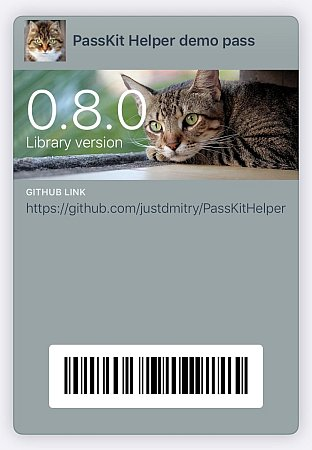

# PassKit Helper

Helper library for all your Apple PassKit (Apple Wallet, Apple Passbook) needs: 

* create passes
* sign pass packages
* receive [de]install notifications
* send pass updates

**Attention:** Apple Developer Account required!

[](https://www.nuget.org/packages/PassKitHelper/) 

## Features

1. Create pass packages (`*.pkpass` files):
    * With Fluent-styled `PassInfoBuilder` and `PassPackageBuilder`
    * Using `byte[]` and/or `Stream` as content images
    * Using `byte[]` or `Stream` or `X509Certificate2` as certificates
    * Receive `MemoryStream` as result (save it to file or write to HttpResponse)
2. Receive notifications from Apple about pass [de]installations and send updates:
    * Add `UsePassKitMiddleware` into your `Startup.Configure()`
    * Implement `IPassKitService` for real processing.

## Samples

### 1. Configure to create passes

#### For console app

```csharp
var options = new PassKitOptions()
{
    PassCertificate = new X509Certificate2(File.ReadAllBytes("pass.pfx")),
    AppleCertificate = new X509Certificate2(File.ReadAllBytes("AppleWWDRCA.cer")),
    ConfigureNewPass = p =>
    {
         p.Standard
             .PassTypeIdentifier("your-pass-type-identifier")
             .TeamIdentifier("your-team-identifier")
             // Add more "defaults" here if needed
    }
};

IPassKitHelper passKitHelper = new PassKitHelper(options);
```

#### For web app

```csharp
public void ConfigureServices(IServiceCollection services)
{
    services.AddPassKitHelper(options =>
    {
        options.PassCertificate = new X509Certificate2(File.ReadAllBytes("pass.pfx"));
        options.AppleCertificate = new X509Certificate2(File.ReadAllBytes("AppleWWDRCA.cer"));
        options.ConfigureNewPass = p =>
        {
            p.Standard
               .PassTypeIdentifier("your-pass-type-identifier")
               .TeamIdentifier("your-team-identifier")
               // Add more "defaults" here if needed
    });
}

```

### 2. Creat pass and pass package file

Check Apple's [PassKit Package Format Reference](https://developer.apple.com/library/archive/documentation/UserExperience/Reference/PassKit_Bundle/Chapters/Introduction.html) for detailed description of all fields and valid values.

```csharp
var pass = passKitHelper.CreateNewPass()
    // This pass already has `PassTypeIdentifier`, `TeamIdentifier` 
    // and all other values you configured in options.
    .Standard
        .SerialNumber("PassKitHelper")
        .OrganizationName("PassKit")
        .Description("PassKitHelper demo pass")
    .VisualAppearance
        .Barcodes("1234567890128", BarcodeFormat.Code128)
        .LogoText("PassKit Helper demo pass")
        .ForegroundColor("rgb(44, 62, 80)")
        .BackgroundColor("rgb(149, 165, 166)")
        .LabelColor("rgb(236, 240, 241)")
    .StoreCard
        .PrimaryFields
            .Add("version")
                .Label("Library version")
                .Value(libraryVersion)
        .AuxiliaryFields
            .Add("github")
                .Label("GitHub link")
                .Value("https://github.com/justdmitry/PassKitHelper");

var passPackage = passKitHelper.CreateNewPassPackage(pass)
    .Icon(await File.ReadAllBytesAsync("images/icon.png"))
    .Icon2X(await File.ReadAllBytesAsync("images/icon@2x.png"))
    .Logo(await File.ReadAllBytesAsync("images/logo.jpg"))
    .Strip(await File.ReadAllBytesAsync("images/strip.jpg"))
    .Strip2X(await File.ReadAllBytesAsync("images/strip@2x.jpg"));

MemoryStream packageFile = await passPackage.SignAndBuildAsync();

// Now you have to "deliver" package file to user using any channel you have
// (save as attachment in email, download from your webapp etc)
await File.WriteAllBytesAsync("Sample.pkpass", packageFile.ToArray());
```

Code above will create this beautiful pass:



### 3. Implementing WebService for interaction

Apple's server can call your endpoint/server to notify about user installed/deinstalled your pass, to fetch updated version of pass (when user 'pulls down' pass in Wallet). You will be able to send pushes when you want to update pass in user's wallet. Check Apple's [PassKit Web Service Reference](https://developer.apple.com/library/archive/documentation/PassKit/Reference/PassKit_WebService/WebService.html) for technical details.

#### 3.1. Implement IPassKitService

```csharp
public class PassKitService : IPassKitService
{
    public Task<int> RegisterDeviceAsync(…) {…}

    public Task<int> UnregisterDeviceAsync(…) {…}

    public Task<(int status, string[]? passes, string? tag)> GetAssociatedPassesAsync(…) {…}

    public Task<(int statusCode, MemoryStream? passData)> GetPassAsync(…) {…}

    public Task ProcessLogsAsync(…) {…}
}
```

#### 3.2. Register in `Startup`

```csharp
public void ConfigureServices(IServiceCollection services)
{
    ...
    services.AddSingleton<IPassKitService, PassKitService>();
}

public void Configure(IApplicationBuilder app)
{
    ...
    app.UsePassKitMiddleware("/callbacks/passkit");
    ...
}
```

#### 3.3 Add information inside your passes

You need publicly-accessible url/hostname for your server, and it must be secured with https/ssl.

Add this information into your passes:

```csharp

var pass = passKitHelper.CreateNewPass()
     // your 
     // original 
     // pass content 
     // goes here
   .WebService
       .AuthenticationToken("some-random-secret-string")
       .WebServiceURL("https://you.server.com/callbacks/passkit")

```

AuthenticationToken is some "secret" string that you use to differentiate legal pass owners and malicious hackers.

WebServiceURL is hostname of your server and path that equal to one in `UsePassKitMiddleware` in previous step.

#### 3.4. Send push updates

When users install your pass package to their iOS and Mac devices - Apple server calls your `RegisterDeviceAsync`. Save `pushToken` value in database, and when you need to update pass on user's device - call `IPassKitHelper.SendPushNotificationAsync(pushToken)`.

## Installation

Use NuGet package [PassKitHelper](https://www.nuget.org/packages/PassKitHelper/)

## Dependencies

For `netcoreapp3.1`:
* Microsoft.Extensions.Http, v3.1.1
* Newtonsoft.Json, v12.0.2
* System.Security.Cryptography.Pkcs, v4.6.0

For `netstandard2.0`:
* Microsoft.AspNetCore.Http.Abstractions, v2.1.1
* Microsoft.Extensions.DependencyInjection.Abstractions, v2.1.1
* Microsoft.Extensions.Logging.Abstractions, v2.1.1
* Microsoft.Extensions.Http, v2.1.1
* Newtonsoft.Json, v12.0.2
* System.Security.Cryptography.Pkcs, v4.6.0

## Dvelopment & Testing

You need `netcore3.1` to run build and tests;

Tests can be run with `dotnet test`.

## Credits

* Thanks for inspiration to Tomas McGuinness and his [dotnet-passbook](https://github.com/tomasmcguinness/dotnet-passbook) package.
* Thanks to [maxpixel.net](https://www.maxpixel.net) for sample kitten images.
